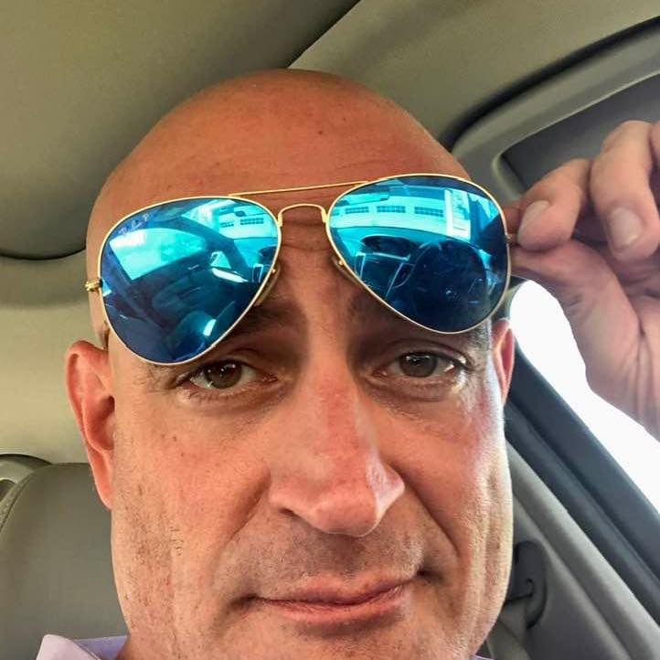

# 👋 Hi, I'm Philip Humpherys  

  

**MBA | Site Reliability Engineer | DevOps | Cloud Architect**  

  
  
 
 
 
 
 
  

---

## 🚀 Professional Summary  

Accomplished Senior Systems Engineer, Solutions Architect, and Site Reliability Engineer with 20+ years of experience leading **DevOps**, **Infrastructure as Code (IaC)**, and **Cloud** initiatives. I specialize in building reliable, scalable, and secure systems — from pioneering virtualization projects at Hill Air Force Base to architecting AWS enterprise environments at Dental Intelligence.  

- Lead Site Reliability Engineer at **Dental Intelligence**, managing AWS infrastructure and CI/CD with Terraform, Kubernetes, and Azure DevOps. Delivered enterprise applications with **PHP Laravel Framework**.  
- Former **Senior DevOps Engineer at Verisk**, where I built IaC frameworks with Terraform/CDKTF, managed Kubernetes workloads, and migrated data centers to AWS. Developed and maintained applications with the **Java Spring Framework**.  
- **Senior Solutions Architect at RackWare**, delivering hybrid-cloud migrations and enterprise DR solutions.  
- Deep experience with **VMWare, Nutanix, Linux/Unix, networking, SAN/NAS, and enterprise-scale systems administration**.  
- Proven mentor, project leader, and communicator with an MBA from the University of Utah and BS in Computer Science from BYU.  

---

## 🛠️ Skills  

- **Cloud & IaC**: AWS (EC2, S3, ECS/EKS, RDS, Lambda, IAM, CloudFront, CloudWatch, SQS, SNS), Terraform, Ansible, CloudFormation, CDKTF  
- **DevOps & CI/CD**: Azure DevOps, GitHub Actions, Docker, Kubernetes, Helm, Splunk, Dynatrace, OpenSearch/Kibana  
- **Frameworks**: **Java Spring**, **PHP Laravel**  
- **Systems & Networking**: Unix/Linux, VMware/vSphere, Nutanix, SAN/NAS, Firewalls, VPN, Routing (BGP, OSPF, EIGRP, RIP)  
- **Programming & Scripting**: Python, Bash, PowerShell, Java, Node.js, Ruby, PHP, C/C++  
- **Other**: Agile/Scrum, Project Management, Cost Optimization, Technical Writing, Security & Compliance (HIPAA, SOC2, PCI, GDPR)  

---

## 🏆 Highlights  

- **Pioneered Virtualization** at Hill AFB and KSL.com, saving millions in costs and driving efficiency.  
- **Led Enterprise DR/BCP** planning and testing, reporting RPO/RTO directly to CIOs.  
- **Migrated On-Prem to AWS** at scale for Fortune 500 clients.  
- Delivered enterprise apps using **Java Spring** and **PHP Laravel Frameworks**.  
- **Utah State Chess Champion, 2016** ♟ — strategic thinker on and off the board.  

---

## 📂 Projects  

- [**SWAPI Playground (GitLab)**](https://gitlab.com/phumpherys-group/challenge-v4)  
  Terraform + AWS S3 static hosting with CloudFront and CI/CD pipelines.  

- **Kubernetes “Mate-in-1” API**  
  Fun FastAPI-based chess project deployed in Kubernetes with autoscaling, Prometheus metrics, and HPA.  

- **Hybrid Cloud Migration (RackWare)**  
  Architected and deployed hybrid cloud solutions for large-scale enterprise DR, bridging VMware vCloud and AWS.  

- **AWS DR/BCP Automation**  
  Designed Disaster Recovery Plans at Dental Intelligence, tested and automated failover with Terraform + Runbooks.  

---

## 🎓 Education & Certifications  

- **MBA**, University of Utah – David Eccles School of Business  
- **BS, Computer Science**, Brigham Young University  
- **AWS Certified Practitioner**  
- **VMWare Certified Professional (VCP)**  

---

## 📫 Contact  

- 📍 Salt Lake City, UT  
- 📧 phumpherys@gmail.com  
- 📱 801-414-3948  
- 🌐 [LinkedIn](https://www.linkedin.com/in/philhumpherys/)  
- 🌐 [GitHub](https://github.com/phumpherys64/phumpherys64)  

---

## ⚡ Fun Fact  
I bring the same passion and precision to my engineering work that I once brought to the chessboard as Utah’s State Chess Champion.  
